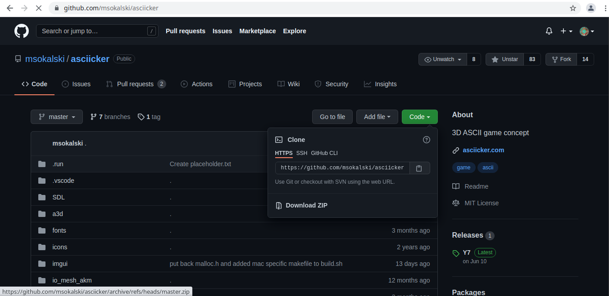
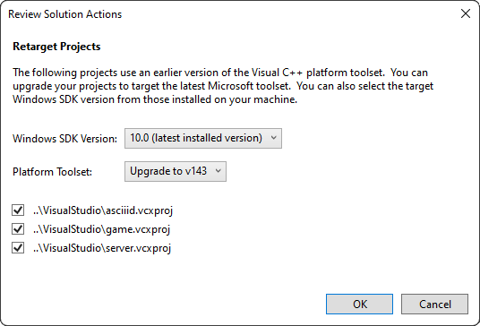
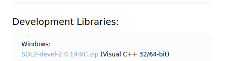

# Asciiid


## Installation
Firstly, you need to choose build type:
- Cmake (Every OS)
- MSBuild, aka Visual Studio (Windows only)
- Make (Every OS)
- (Special) Compiling for web

### For windows it's recommended to use Visual Studio build system:
1) Install [Visual Studio](https://visualstudio.microsoft.com/) (Only once)
2) Download the repository  and unzip it, the folder should be named `asciiid-sdl`, rename it to `asciiid` (Important!)
3) Open VisualStudio and click `Import project`, then navigate to the folder where you stored `asciiid` and select it 
4) Retarget solutions (this step may not be needed in some cases)

5) Install [SDL2](https://www.libsdl.org/download-2.0.php) (Only once)





5) Copy `include` and `lib` directories into `SDL\` directory in the root of the repository
6) Build asciiid
7) Copy `lib\(your_architecture_here)\SDL.dll` into `build` directory
8) Run `asciiid`!

### For every other OS, it's recommended to use CMake:
1) Install [CMake](https://cmake.org/download/) (Only once)
2) Install [git](https://git-scm.com/downloads) (Only once)
3) Install prefered build system, main ones are: [Ninja](https://github.com/ninja-build/ninja/releases), [Make](https://www.gnu.org/software/make/), [MinGW-Make](https://sourceforge.net/projects/mingw/), [MSYS-Make](https://www.msys2.org/) (Only once).
4) Open terminal and enter: `git clone https://github.com/Niki4tap/asciiid.git && cd asciiid && mkdir build && cd build`
5) Build:
```
Ninja:  cmake -G "Ninja" .. && ninja
Make:   cmake -G "Unix Makefiles" .. && make
MinGW:  cmake -G "MinGW Makefiles" .. && mingw32-make
MSYS:   cmake -G "MSYS Makefiles" .. && make
```
6) Run `asciiid`!

### MakeFiles:
1) Install [git](https://git-scm.com/downloads) (Only once)
2) Install [Make](https://www.gnu.org/software/make/) (Only once)
3) Open terminal and enter: `git clone https://github.com/Niki4tap/asciiid.git && cd asciiid && mkdir build && cd Scripts && ./build.sh && cd ../build`
4) Run `asciiid`!

---

### Compiling for web with emscripten:
Based on: [Webassembly Guide](https://webassembly.org/getting-started/developers-guide/)
Currently works only with linux.

1) Install emscripten:
```
# Only once
cd ~
git clone https://github.com/emscripten-core/emsdk.git
cd emsdk
./emsdk install latest
./emsdk activate latest
```
2) Set up environmental variables:
Notice: emscripten offers several setup scripts, so if you have different shell,
you can look into `~/emsdk` and choose `emsdk_env.fish` for example, if you use fish shell.
```
cd ~/emsdk
source ./emsdk_env.sh --build=Release
```
3) Run build script: `cd Scripts && ./build-web.sh`
4) Open your web browser and go to `http://localhost:8888/`
